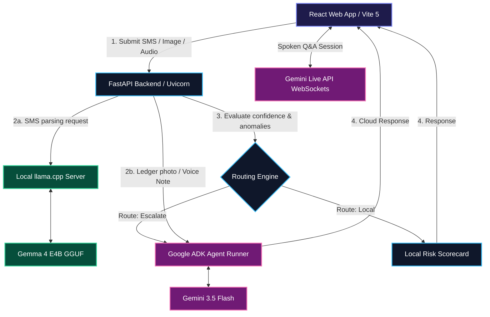

# Project Setu: Adaptive AI Credit Risk Routing for Microfinance (MFI)

[](file:///d:/Desktop%20Data/ML/Projects/setu/Setu/project_overview.md)
[](file:///d:/Desktop%20Data/ML/Projects/setu/Setu/backend/main.py)
[](file:///d:/Desktop%20Data/ML/Projects/setu/Setu/frontend/package.json)

---

## 🌟 About the Project

**Project Setu** ("Setu" meaning *bridge* in Sanskrit) is an adaptive, hybrid AI routing system engineered for microfinance institutions (MFIs) in emerging economies. The platform empowers MFI field officers to instantly assess the creditworthiness of unbanked, informal-sector borrowers using messy, unstructured, and multi-modal inputs—such as SMS transaction logs, handwritten ledger photos (daybooks), and conversational voice notes. 

Setu is built on a **hybrid Edge-Cloud architecture**:
- **Local Layer:** Lightweight, privacy-preserving, and offline-capable extraction of financial metrics from SMS records using a localized **Gemma 4 E4B** model running via `llama.cpp` on the edge.
- **Escalation Engine:** An anomaly-detection router that flags low-confidence or high-risk cases and seamlessly escalates them to cloud-hosted **Gemini 3.5** models for deeper multi-modal analysis (reading handwritten ledger photos or transcribing verbal income descriptions).
- **Gemini Live Q&A:** A real-time voice-interactive layer powered by the **Gemini Live API**, allowing field officers to have a natural spoken conversation about a borrower's risk profile ("*Why is this borrower categorized as medium risk?*").

---

## 🎯 Problem Statement

Microfinance field officers face major bottlenecks when underwriting borrowers in the informal sector:
1. **Lack of Formal Credit Data:** Borrowers typically lack formal paystubs, bank statements, or bureau scores. Instead, their financial histories exist inside informal ledger books, cash-in/cash-out SMS logs, and verbal narratives.
2. **Connectivity and Privacy Constraints:** Field officers work in remote areas with unstable network connectivity. Uploading complete, sensitive financial records directly to the cloud raises data privacy concerns and suffers from high latency.
3. **Complex Manual Auditing:** Interpreting handwritten ledgers and cross-referencing cash flows manually is slow and highly prone to subjective errors.

---

## 🚀 Impact

- **Instant Underwriting:** Redefines credit decisions from days to seconds, allowing on-the-spot borrower onboarding.
- **Optimized Compute Costs:** Minimizes cloud API costs by routing clean, standard cases to the free, locally-running Gemma model, reserving cloud-based Gemini API calls for anomalous or multi-modal inputs.
- **High Financial Inclusion:** Decodes informal data points (like regional UPI transaction SMS messages and vernacular ledger images) to build structured credit scorecards for individuals who are otherwise invisible to the financial system.

---

## 🛠️ Technological Stack

Setu combines cutting-edge edge compute with state-of-the-art cloud intelligence:

| Layer | Component | Technologies Used |
|---|---|---|
| **Frontend** | Interactive Web Dashboard | React, Vite 5, TailwindCSS, Framer Motion, Three.js (BridgeScene 3D animation) |
| **Backend** | REST API & Scoring Server | Python, FastAPI, Pydantic, Uvicorn |
| **Local LLM Engine** | Edge Extraction | `llama.cpp` (Windows CPU-optimized binaries), **Gemma 4 E4B IT** (Quantized Q4_K_M GGUF format) |
| **Cloud LLM SDKs** | Intelligent Escalation | `google-adk` (Managed Agent Framework), `google-genai` (v2 SDK), **Gemini 3.5 Flash** |
| **Voice Layer** | Conversational Live QA | Gemini Live API (WebSockets), PyAudio |

---

## 📐 Architecture & Data Flow



---

## 📂 Codebase Directory Structure

```text
Setu/
├── backend/
│   ├── __init__.py
│   └── main.py                     # FastAPI Application containing endpoint handlers
├── frontend/
│   ├── src/
│   │   ├── api/
│   │   │   ├── client.ts           # Axios client configured for backend endpoints
│   │   │   ├── config.ts           # Toggle MOCK_MODE, base URL, and timeouts
│   │   │   └── types.ts            # TypeScript interfaces matching backend models
│   │   ├── components/
│   │   │   ├── InputSelector.tsx   # Recording, upload, and selection interface
│   │   │   ├── ResultCard.tsx      # SVG Radial Gauge, explanations, and flags
│   │   │   └── ProcessingView.tsx  # Interactive Three.js/3D rendering status view
│   │   └── main.tsx
│   ├── package.json                # Frontend dependencies pin-pointed for Node 20
│   └── vite.config.ts
├── pipeline.py                     # Integrates SMS extraction & routing criteria
├── routing_engine.py               # Algorithmic decision logic (escalation rules)
├── extract_sms.py                  # CLI controller for local llama-server execution
├── voice_qa.py                     # Voice Q&A prototype using the Gemini Live API
├── schema.json                     # JSON Schema Draft-07 enforcing BorrowerFinancialData
└── voice_capabilities_summary.md   # Setup and usage guide for audio layers
```

---

## ⚙️ How to Replicate and Run on Your Local System

### Prerequisites
- **Python:** 3.10, 3.11, or 3.12 installed
- **Node.js:** v20.x or newer
- **Mic Access:** Required for running the Voice Note and Voice Q&A demos

---

### Step 1: Set up the Backend

1. **Clone the repository and navigate to the project directory:**
   ```bash
   cd Setu
   ```

2. **Create and activate a virtual environment:**
   ```bash
   # Windows
   python -m venv venv
   venv\Scripts\activate

   # macOS / Linux
   python3 -m venv venv
   source venv/bin/activate
   ```

3. **Install python packages:**
   ```bash
   pip install -r backend/requirements.txt
   # Ensure you have google-genai and google-adk installed
   pip install google-genai google-adk fastapi uvicorn pydantic requests
   ```

4. **Configure your Environment Variables:**
   Create a `.env` file in the root `Setu/` directory and insert your Gemini API Key:
   ```env
   GEMINI_API_KEY=your_actual_gemini_api_key_here
   ```

5. **Start the FastAPI server:**
   ```bash
   python -m uvicorn backend.main:app --port 8000
   ```
   The backend will now be live on [http://localhost:8000](http://localhost:8000).

---

### Step 2: Set up the Frontend

1. **Open a new terminal and navigate to the `frontend/` directory:**
   ```bash
   cd Setu/frontend
   ```

2. **Install Node dependencies:**
   ```bash
   npm install --legacy-peer-deps
   ```

3. **Run the Vite development server:**
   ```bash
   npm run dev
   ```
   Open your browser and navigate to the link output in the console (usually [http://localhost:5173](http://localhost:5173)).

---

### Step 3: Run the Live Voice Q&A Demo (Optional CLI Prototype)

To test the real-time spoken conversational agent powered by the Gemini Live API:

1. Make sure your microphone is connected and working.
2. In your backend terminal (or a new terminal with the `venv` active), run:
   ```bash
   python voice_qa.py
   ```
3. Follow the CLI prompts to start a live talk session. You can speak into your microphone and get real-time audio answers grounded on the borrower's scorecard context.

---

## 🔒 Security & Data Privacy Note

When processing credit risk records:
- **Local Route:** SMS messages evaluated under `route="local"` never leave the user's host machine, providing 100% data privacy.
- **Escalation Route:** Outsized transactions, anomalies, or ledger photos are processed using secure HTTPS transit to Gemini APIs. The system strips extraneous metadata before dispatching.

---

## 🤝 Acknowledgments

Developed during the Google DeepMind Bangalore Hackathon 2026. Designed to bridge the digital gap in microfinance underwriting.
